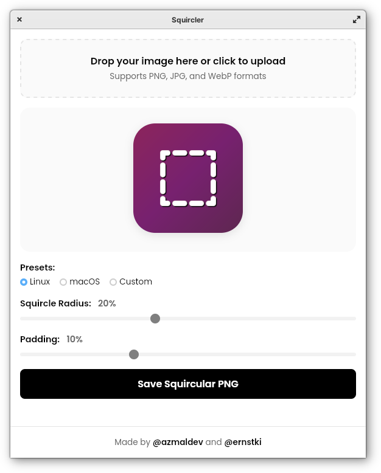

# Squircler

**Squircler** is an overcomplicated [Tauri][] (v2) wrapper around
[azmaldev][]'s delightfully minimal [squircle-generator][original] HTML app.
Thus, in spite of itself, Squircler provides a cross-platform, single-binary
solution for transforming images into squircle shapes.

Whether you're designing app icons, preparing brand assets, or creating profile
images, this tool helps you convert any image into a beautifully rounded
squircle with precision and ease.

This is a focused utility designed for creators, developers, and designers who
value speed, control, and clean visuals — without relying on heavy graphic
design software or sketchy, advertising-laden web apps.

---

## Why use Squircler?

- No login or sign-up required
- No watermarks or branding
- Standalone, offline-capable binary, built for any OS, using your OS's native
  web view component, _e.g._ `libwebkit2gtk` on Linux
- Extremely lightweight and fast
- Download ready-to-use transparent PNGs
- Ideal for developers, designers, and marketers
- Open-source; free to tinker with and make it your own

---

## Key features

- Upload images (JPG, PNG, WebP) with drag-and-drop or click
- Control padding using a simple, accurate slider
- Preview the squircle effect in real-time
- Download the final result as a high-quality PNG
- Sharp output with smooth curves and accurate alignment
- Clean, modern UI with zero distractions

---

## Online version

_Original source: [azmaldev/squircle-generator][original]_

There's an online (web app) version available [here][webapp].

---

## Use cases

- App icon design (Android/iOS or Progressive Web Apps)
- Profile pictures for social platforms or dashboards
- Design mockups or branding elements with soft corners
- Rounded avatars for user interfaces
- Generating image assets for no-code platforms
- Quick cropping for portfolios and landing pages

---

## Built by

[@azmaldev][azmaldev] and me. 

> This project is part of a collection of minimalist online tools built for
> speed, utility, and modern design thinking.

### Icon credit

[Original icon][icon] by Kevin Ernst, with help from Gemini 3.5 Flash-Lite for
the "squircle" SVG geometry, inspiration taken from Daniel Witt's [Squircle
Icon Maker][dansapp], and many apologies to people who dislike the Ubuntu
"aubergine" color scheme.

[tauri]: https://tauri.app/
[azmaldev]: https://github.com/azmaldev
[original]: https://github.com/azmaldev/squircle-generator
[webapp]: https://azmaldev.github.io/squircle-generator
[icon]: img/icon.svg
[dansapp]: https://apps.apple.com/us/app/squircle-icon-maker/id6476942163
